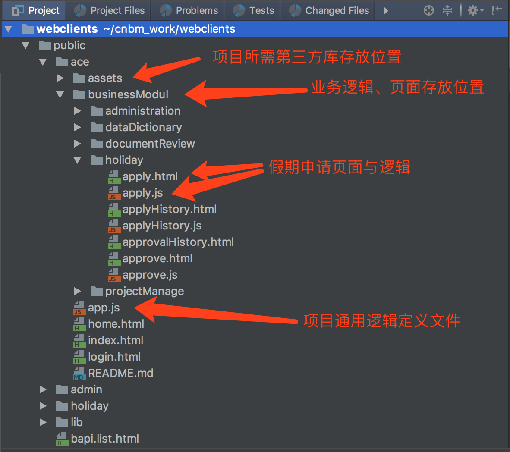
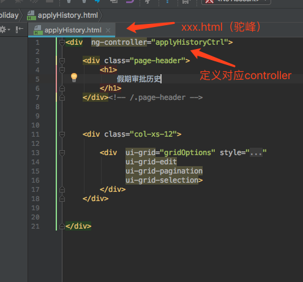
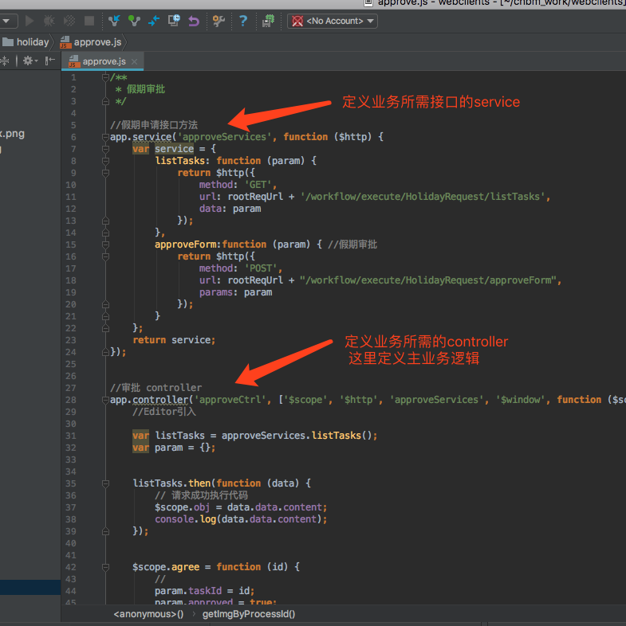

webclients 开发文档
===============

## 项目背景

此为大宗物联项目开发 

## 前端项目开发准备

IDE 推荐webstrom  
办公无线网络  Xiaomi1F7C 密码 testsrv123

服务器ip   
192.168.99.10  （代码现存放在10服务器）

192.168.99.84

192.168.99.12

192.168.99.223

## 项目代码结构概述

## 业务页面开发流程举例（此处以请假流程为例）

### 业务逻辑采用view + controller 开发模式

#### step 1 新建xxx.html  作为业务view页面  
#### step 2 加入对应 controller
参考下图

#### step 3 新建xxx.js 文件  作为业务controller页面

参考下图

